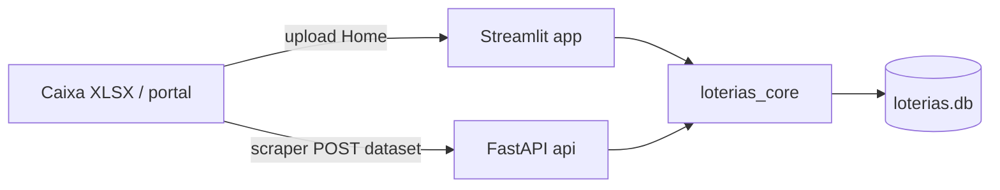

# ARCHITECTURE_NOTES — ApostasLoteria

Notas de arquitetura alinhadas ao código em **julho/2026**.  
Para execução passo a passo, use [COMO_EXECUTAR.md](COMO_EXECUTAR.md). Para visão de produto, o [README](../README.md).

---

## 1. Visão em uma frase

**Domínio puro em `loterias_core` + persistência SQLite única; Streamlit e FastAPI são bordas finas que não se chamam por HTTP.**



---

## 2. Árvore relevante

```
ApostasLoteria/
├── api/
│   ├── main.py                 # FastAPI app (version 0.2.0)
│   ├── config.py · deps.py · schemas.py · limiter.py
│   ├── exceptions.py · logging_config.py
│   ├── routes/
│   │   ├── health.py · lotteries.py
│   │   ├── verify.py · combinations.py · forecast.py · dataset.py
│   └── services/core.py
├── app/
│   ├── Home.py                 # entrypoint Streamlit
│   ├── author.py               # identidade pública (ersjunior)
│   ├── config.py               # secrets → env + ensure_database
│   ├── combinations/generator.py
│   ├── core/lotteries.py       # reexport do catálogo do core
│   ├── pages/
│   │   ├── 1_📊_Estatísticas.py
│   │   ├── 2_🎯_Verificação.py
│   │   ├── 3_🔮_Combinações_Inéditas.py
│   │   ├── 4_👨‍💻_Feito por.py
│   │   └── 5_📜_Histórico.py
│   ├── services/               # wrappers Streamlit (@st.cache_data, report PDF, …)
│   ├── ui/
│   │   ├── shell.py            # sidebar global (loteria + tema)
│   │   ├── lottery_selector.py
│   │   ├── theme.py · theme_manager.py
│   └── data/                   # loterias.db em runtime (gitignored)
├── loterias_core/
│   ├── lotteries.py            # catálogo canônico (9 modalidades)
│   ├── dataset.py · repository.py · storage.py · schema.py
│   ├── statistics.py · generator.py · validator.py · scraper.py
│   ├── combinatorics.py · expected_value.py · user_history.py
├── docker/                     # Dockerfile.api · Dockerfile.streamlit · entrypoint.sh
├── docs/
├── scripts/smoke_api.py
├── tests/
├── docker-compose.yml
└── pyproject.toml              # deps + ruff/mypy/pytest/coverage (sem pytest.ini)
```

**Observações**

- Não existe `app/main.py` nem página `Forecast.py` — o gerador vive em Combinações Inéditas.
- Não há camada de ML nem scikit-learn em produção — as combinações são geradas por sorteio aleatório uniforme.
- `requirements*.txt` são atalhos (`-e ".[…]"`).

---

## 3. Inventário por camada

### 3.1 `loterias_core` (domínio)

| Módulo | Responsabilidade | Público relevante |
|--------|------------------|-------------------|
| `lotteries.py` | Catálogo `LotteryConfig`, `LOTTERIES`, `LOTTERIES_BY_KEY` | configs por nome/key |
| `storage.py` | Path do DB, schema WAL, conexão | `DEFAULT_DB_PATH`, `get_connection` |
| `repository.py` | Load/persist/update/cache por `lottery_key` | `load_lottery_dataframe`, `persist_*`, `get_cache_status` |
| `dataset.py` | Enrich / handlers (Dupla Sena, Super Sete, +Milionária, Lotomania) | `process_raw_dataset`, `build_dataset_from_dataframe` |
| `statistics.py` | Frequência clássica + extras / draw / posição | `frequency`, `extra_field_frequency`, `frequency_by_draw`, `frequency_by_position`, … |
| `generator.py` | Combinações inéditas (aleatório) | `generate_unique_combination_games` |
| `validator.py` | Jogo já sorteado? | `check_game` |
| `scraper.py` | Download XLSX / JSON portal Caixa | `download_lottery_data` |
| `combinatorics.py` / `expected_value.py` | C(n,k), EV, house edge | helpers usados na UI |
| `schema.py` | Validação de colunas do XLSX | `DatasetSchemaError` |
| `user_history.py` | CRUD de `user_games` | add/list/delete/clear/export |

### 3.2 `app/` (Streamlit)

| Peça | Papel |
|------|--------|
| `Home.py` | Hero, status das bases, upload → `persist_dataset` |
| `ui/shell.py` | `render_app_chrome`: tema + selectbox de loteria (`selected_lottery`) |
| `pages/*` | Features; chrome no topo; badge de loteria onde faz sentido |
| `services/*` | Cache Streamlit, reexports, `report.generate_statistics_pdf` |
| `author.py` | `GITHUB_USER=ersjunior`, LinkedIn, nome de exibição |
| `config.py` | Secrets Cloud → `LOTTERIAS_DB_PATH`; `ensure_database()` |

### 3.3 `api/` (FastAPI)

| Peça | Papel |
|------|--------|
| `main.py` | App, CORS, body limit, routers canônicos + aliases Mega-Sena |
| `deps.py` | `resolve_lottery(lottery_key)` |
| `routes/*` | Endpoints documentados no README / COMO_EXECUTAR |
| `services/core.py` | Orquestra `loterias_core` (verify, combinations, dataset update) |

Versão anunciada na OpenAPI: **0.2.0** (pacote `pyproject`: 0.1.0 — versionamento de release separado).

---

## 4. Persistência

Arquivo padrão: `app/data/loterias.db` (`LOTTERIAS_DB_PATH`).

| Tabela | Conteúdo |
|--------|----------|
| `lottery_metadata` | Cache por modalidade (`last_concurso`, `total_records`, …) |
| `draws` | Sorteios; UNIQUE `(lottery_key, concurso, draw_index)`; `jogo` / `extra_data` JSON |
| `user_games` | Histórico local do usuário (sem conta) |

**Ingestão**

| Caminho | Entrada | Destino |
|---------|---------|---------|
| Upload Home | XLSX → `read_excel` → `persist_dataset` | SQLite |
| API `POST /lotteries/{key}/dataset` | Scraper → update incremental | SQLite |

Não há store operacional em CSV por loteria.

---

## 5. Streamlit ↔ API

| Capacidade | Streamlit | API |
|------------|-----------|-----|
| 9 loterias | Sim (sidebar) | Sim (`/lotteries/{key}/…`) |
| Upload XLSX | Sim (Home) | Não (usa scraper) |
| Estatísticas / PDF | Sim | Não |
| Histórico `user_games` | Sim | Não |
| Verify / combinations | Sim | Sim |
| Health / catálogo | Status na Home | `GET /health`, `GET /lotteries` |

Única HTTP **externa** no Streamlit: GitHub API na página Feito por (`app.author.GITHUB_USER`).

---

## 6. UI shell e tema

1. Cada página chama `st.set_page_config` e em seguida `render_app_chrome(...)`.
2. Sidebar **Controles**: loteria (`key=selected_lottery`, exceto Feito por) + radio Escuro/Claro.
3. `.streamlit/config.toml` define o tema de **boot** (dark); `theme_manager.apply_theme()` injeta CSS em runtime.
4. Upload na Home usa key separada `upload_lottery` para não misturar com a modalidade de análise.

---

## 7. Estatísticas especiais

Além da frequência clássica da coluna `jogo`:

| Modalidade | Helper | UI |
|------------|--------|-----|
| +Milionária | `extra_field_frequency(..., "trevos")` | Barras dos trevos |
| Dupla Sena | `frequency_by_draw` | Dois gráficos (sorteio 1 / 2) |
| Super Sete | `frequency_by_position` | Heatmap coluna × dígito |
| Timemania | `extra_field_frequency(..., "timecoração")` | Top times |

Disclaimer na UI: histórico ≠ previsão.

---

## 8. Docker e CI

- Compose: serviços `streamlit` (:8501) e `api` (:8000); volume `apostas-data`; `LOTTERIAS_DB_PATH=/app/app/data/loterias.db`.
- Imagem Streamlit inclui `.streamlit/config.toml`; `secrets.toml` fica fora (`.dockerignore`).
- CI: lint/testes (matriz 3.11/3.12); Docker workflow build + `scripts/smoke_api.py`.

---

## 9. Decisões de design

1. **Entrypoints:** Streamlit → `app/Home.py`; API → `uvicorn api.main:app`.
2. **Um banco, duas bordas** — evita corrida XLSX/CSV e duplicação de parsers.
3. **Sem ML em produção** — combinações = `random` uniforme + filtro de inéditas.
4. **Aliases Mega-Sena** — compatibilidade com clientes antigos; preferir rotas `/lotteries/{key}/…`.
5. **Docs de execução** vivem em `COMO_EXECUTAR.md`; este arquivo descreve *como o sistema está organizado*.

---

## 10. Fora do escopo atual (consciente)

- Campo “mês da sorte” no Dia de Sorte (`extra_fields` ainda não modelado)
- Seções especiais no PDF de estatísticas
- API HTTP para estatísticas / histórico do usuário
- Troca do tema nativo Streamlit sem restart (só CSS runtime)
