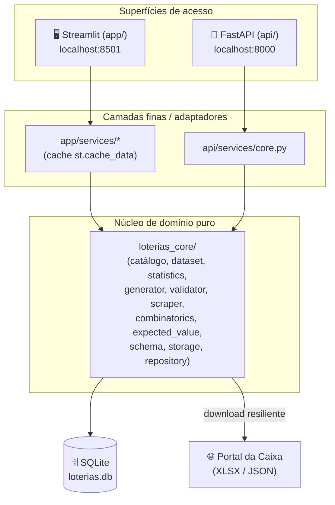
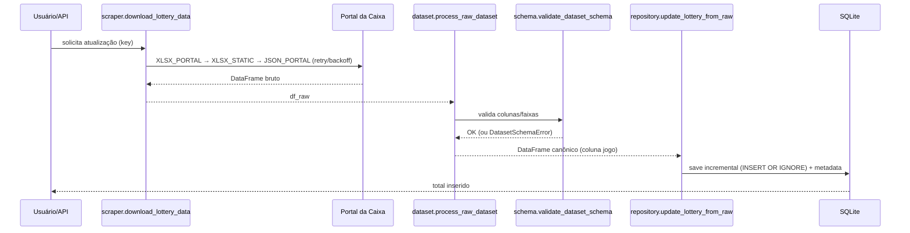

# 📚 ApostasLoteria — Documentação Completa do Projeto

> **Um livro técnico sobre a plataforma de análise estatística, verificação de jogos e geração de combinações inéditas para as loterias brasileiras.**
>
> Este documento descreve, em profundidade, **tudo** que compõe o projeto: objetivos, arquitetura, tecnologias, modelo de dados, cada módulo do domínio, cada rota da API, cada página, seção, card, botão e campo da interface, além dos fluxos completos, decisões de engenharia, configuração, execução, testes e deploy.

---

## Sumário

1. [Sobre o autor](#1-sobre-o-autor)
2. [O que é o projeto](#2-o-que-é-o-projeto)
3. [Objetivos e filosofia](#3-objetivos-e-filosofia)
4. [Para quem é, para que serve e onde usar](#4-para-quem-é-para-que-serve-e-onde-usar)
5. [Aviso legal e jogo responsável](#5-aviso-legal-e-jogo-responsável)
6. [Visão geral da arquitetura](#6-visão-geral-da-arquitetura)
7. [Stack tecnológica](#7-stack-tecnológica)
8. [Estrutura de diretórios](#8-estrutura-de-diretórios)
9. [Modalidades de loteria suportadas](#9-modalidades-de-loteria-suportadas)
10. [Modelo de dados e persistência (SQLite)](#10-modelo-de-dados-e-persistência-sqlite)
11. [O núcleo de domínio: `loterias_core`](#11-o-núcleo-de-domínio-loterias_core)
12. [A aplicação Streamlit](#12-a-aplicação-streamlit)
13. [A API REST (FastAPI)](#13-a-api-rest-fastapi)
14. [Fluxos completos ponta a ponta](#14-fluxos-completos-ponta-a-ponta)
15. [Configuração e variáveis de ambiente](#15-configuração-e-variáveis-de-ambiente)
16. [Como executar](#16-como-executar)
17. [Testes, qualidade e CI/CD](#17-testes-qualidade-e-cicd)
18. [Deploy](#18-deploy)
19. [Glossário de conceitos estatísticos](#19-glossário-de-conceitos-estatísticos)
20. [Solução de problemas (FAQ)](#20-solução-de-problemas-faq)
21. [Roadmap](#21-roadmap)
22. [Licença](#22-licença)

---

## 1. Sobre o autor

O **ApostasLoteria** foi idealizado e desenvolvido por **Eliezer Junior**, profissional de dados com atuação em Engenharia de Dados, Inteligência Artificial, Análise de Dados e BI, e arquiteturas em nuvem (AWS e GCP).

A identidade pública do autor é centralizada em um único módulo (`app/author.py`), garantindo que a interface e a documentação permaneçam sempre alinhadas:

```1:8:app/author.py
"""Identidade pública do autor (fonte única para UI e docs alinhados)."""

from __future__ import annotations

DISPLAY_NAME = "Eliezer Junior"
GITHUB_USER = "ersjunior"
GITHUB_URL = f"https://github.com/{GITHUB_USER}"
```

| Canal | Endereço |
|-------|----------|
| Nome | Eliezer Junior |
| GitHub | https://github.com/ersjunior |
| Repositório | https://github.com/ersjunior/ApostasLoteria |
| LinkedIn | https://www.linkedin.com/in/eliezer-junior/ |

Áreas de atuação profissional do autor refletidas na página **"Feito por"** da aplicação:

- 🏦 **Financeiro / Bancos** — análises de dados, regras de negócio, produtos financeiros e cartões.
- 🛒 **Varejo & Logística** — engenharia de dados, pipelines, métricas operacionais.
- 🌱 **Agronegócio** — estruturação de dados, analytics e suporte à decisão.
- 📊 **BI & Analytics** — Power BI, DAX, modelagem dimensional e storytelling com dados.

**Stack pessoal:** Python, SQL, Pandas, NumPy, Spark, Airflow, AWS, GCP, Power BI/DAX e Streamlit.

---

## 2. O que é o projeto

O **ApostasLoteria** é uma **plataforma analítica e educacional** sobre as loterias da Caixa Econômica Federal. Ele reúne, em um único produto, duas superfícies de uso:

1. **Uma aplicação web interativa** construída em **Streamlit**, voltada ao usuário final, com estatísticas, verificação de jogos, geração de combinações inéditas, histórico local e relatórios em PDF.
2. **Uma API REST** construída em **FastAPI**, voltada a integrações programáticas, oferecendo as mesmas capacidades de domínio de forma automatizável.

Ambas as superfícies compartilham um **núcleo de domínio puro** (`loterias_core`) — sem dependências de UI ou de framework web — e uma **base de dados SQLite única** (`loterias.db`).

> **Princípio central e inegociável:** o projeto **não prevê** resultados de loteria. Cada sorteio é um evento aleatório e independente. Toda análise é **descritiva** (sobre o passado) e **educacional** — nunca preditiva. A "geração de combinações inéditas" é apenas **amostragem aleatória uniforme** de combinações que ainda não saíram no histórico, sem qualquer poder de previsão.

---

## 3. Objetivos e filosofia

### Objetivos

- **Educar** o usuário sobre a natureza aleatória das loterias, desmistificando a "falácia do apostador" (a crença de que dezenas "quentes" ou "frias" influenciam o próximo sorteio).
- **Analisar** o histórico oficial de sorteios de forma estatisticamente honesta: frequências, probabilidade empírica, teste de aderência à uniformidade (qui-quadrado), probabilidade combinatória e valor esperado.
- **Verificar** se um jogo específico já foi sorteado ao longo da história da modalidade.
- **Gerar** combinações que nunca saíram no histórico, deixando explícito que isso **não aumenta** a chance de ganhar.
- **Demonstrar boas práticas de engenharia**: separação de camadas, domínio puro, testes, tipagem, CI/CD, containerização e documentação de qualidade.

### Filosofia de engenharia

| Princípio | Como se manifesta no código |
|-----------|-----------------------------|
| **Domínio puro** | `loterias_core` não importa Streamlit nem FastAPI. É reutilizável e testável isoladamente. |
| **Camadas finas** | `app/services/*` e `api/services/*` apenas adaptam o domínio para cada superfície (cache Streamlit, HTTP FastAPI). |
| **Fonte única de verdade** | Catálogo de loterias (`lotteries.py`), identidade do autor (`author.py`) e banco SQLite único. |
| **Mensagens amigáveis** | Erros de rede, schema e validação sempre viram mensagens legíveis — nunca exceções cruas ao usuário. |
| **Honestidade estatística** | Todos os textos reforçam que histórico ≠ previsão. |
| **Idempotência e atomicidade** | Escritas atômicas de arquivos/banco; ingestão incremental com deduplicação. |

---

## 4. Para quem é, para que serve e onde usar

**Público-alvo:**

- Curiosos e apostadores que querem entender a matemática real por trás das loterias.
- Estudantes de estatística/probabilidade em busca de um exemplo prático e visual.
- Desenvolvedores que desejam estudar uma arquitetura Python limpa (domínio + Streamlit + FastAPI + Docker + CI).

**Para que serve:**

- Explorar o comportamento histórico dos sorteios de forma visual.
- Conferir jogos próprios contra todo o histórico.
- Obter combinações inéditas para diversão (sem ilusão de vantagem).
- Manter um histórico local dos próprios jogos.
- Exportar relatórios (PDF) e dados (CSV).

**Onde usar:**

- **Localmente** no computador (Streamlit em `localhost:8501` e/ou API em `localhost:8000`).
- **Em containers Docker** (via `docker compose`).
- **Na nuvem** (Streamlit Community Cloud para a UI; qualquer runtime de container para a API).

---

## 5. Aviso legal e jogo responsável

- O projeto tem finalidade **estritamente educacional e analítica**.
- **Não** garante, sugere ou prevê resultados. **Não** aumenta chances reais de ganho.
- O **valor esperado (EV)** de qualquer aposta em loteria é **negativo** — no longo prazo, aposta-se mais do que se recebe de volta.
- Todas as páginas exibem um rodapé de **jogo responsável** (`responsible_gaming_footer()`), reforçando esses pontos.
- Jogue com moderação. Loteria é entretenimento, não estratégia de investimento.

---

## 6. Visão geral da arquitetura

O sistema é composto por **três camadas lógicas** e **duas superfícies de acesso** que convergem para uma base de dados única.



**Pontos-chave da arquitetura:**

- O **Streamlit não chama a API por HTTP**. Ambos consomem `loterias_core` diretamente e compartilham o **mesmo arquivo SQLite** (via volume Docker, quando containerizados).
- O domínio é **agnóstico de framework**: pode ser importado por scripts, notebooks, testes ou qualquer outra superfície futura.
- A ingestão de dados oficiais é **resiliente** (retries, timeout, fallback entre fontes) e **transacional** (não corrompe a base anterior em caso de falha).

---

## 7. Stack tecnológica

### Dependências de runtime (Streamlit) — `pyproject.toml`

| Pacote | Versão | Papel |
|--------|--------|-------|
| `streamlit` | 1.53.0 | Framework da aplicação web interativa |
| `pandas` | 2.3.3 | Manipulação de datasets tabulares |
| `numpy` | 2.4.1 | Suporte numérico |
| `plotly` | 6.5.2 | Gráficos interativos (barras, pizza, heatmap) |
| `reportlab` | 4.4.9 | Geração de relatórios em PDF |
| `openpyxl` | 3.1.5 | Leitura de arquivos XLSX oficiais da Caixa |
| `requests` | 2.32.5 | Download das bases e consulta à API do GitHub |
| `kaleido` | 1.2.0 | Exportação de gráficos Plotly como imagem no PDF |

### Dependências opcionais da API (`[api]`)

| Pacote | Versão | Papel |
|--------|--------|-------|
| `fastapi` | 0.128.0 | Framework REST |
| `uvicorn[standard]` | 0.34.0 | Servidor ASGI |
| `pydantic` | 2.12.5 | Validação de schemas de entrada |
| `slowapi` | 0.1.9 | Rate limiting |
| `httpx` | 0.28.1 | Cliente HTTP (smoke test) |

### Dependências de desenvolvimento (`[dev]`)

| Pacote | Versão | Papel |
|--------|--------|-------|
| `pytest` | 9.0.2 | Testes |
| `pytest-cov` | 7.1.0 | Cobertura |
| `ruff` | 0.16.0 | Linter + formatador |
| `mypy` | 2.3.0 | Checagem de tipos |
| `pre-commit` | 4.2.0 | Hooks de qualidade |

### Infraestrutura

- **SQLite** — persistência (modo WAL).
- **Docker / Docker Compose** — containerização de UI e API com volume de dados compartilhado.
- **GitHub Actions** — CI (lint, format, mypy, testes com cobertura) e build/smoke de imagens Docker.
- **Python** — 3.11+ (CI testa 3.11 e 3.12).

---

## 8. Estrutura de diretórios

```
ApostasLoteria/
├── app/                          # Aplicação Streamlit (UI)
│   ├── Home.py                   # Página inicial / hub
│   ├── author.py                 # Identidade pública do autor (fonte única)
│   ├── pages/                    # Páginas multipage do Streamlit
│   │   ├── 1_📊_Estatísticas.py
│   │   ├── 2_🎯_Verificação.py
│   │   ├── 3_🔮_Combinações_Inéditas.py
│   │   ├── 4_👨‍💻_Feito por.py
│   │   └── 5_📜_Histórico.py
│   ├── core/lotteries.py         # Reexporta catálogo do domínio
│   ├── combinations/generator.py # Reexporta gerador do domínio
│   ├── services/                 # Camada fina (cache/adaptação p/ UI)
│   │   ├── dataset.py            # Cache st.cache_data sobre o repositório
│   │   ├── statistics.py         # Reexporta estatísticas do domínio
│   │   ├── report.py             # Geração de PDF (reportlab)
│   │   ├── exporter.py           # Exportação CSV de jogos
│   │   ├── user_history.py       # Histórico local + export CSV
│   │   ├── validator.py          # Reexporta validador
│   │   ├── scraper.py            # Reexporta scraper
│   │   └── cache.py              # Cache auxiliar legado
│   └── ui/                       # Componentes visuais e chrome global
│       ├── shell.py              # Sidebar global (loteria + tema)
│       ├── theme.py              # Componentes estilizados (cards, títulos)
│       ├── theme_manager.py      # Definição de temas + injeção de CSS
│       └── lottery_selector.py   # Selectbox reutilizável de loteria
│
├── api/                          # API REST (FastAPI)
│   ├── main.py                   # Bootstrap, middlewares, routers
│   ├── config.py                 # Settings via variáveis de ambiente
│   ├── deps.py                   # Dependências (resolve_lottery)
│   ├── schemas.py                # Modelos Pydantic + validações
│   ├── limiter.py                # Rate limiter (slowapi)
│   ├── exceptions.py             # Handlers de erro JSON padronizados
│   ├── logging_config.py         # Logging estruturado
│   ├── routes/                   # Rotas: health, lotteries, verify,
│   │                             #        combinations, forecast, dataset
│   └── services/core.py          # Serviços que delegam ao domínio
│
├── loterias_core/                # 🧠 Núcleo de domínio puro
│   ├── lotteries.py              # Catálogo declarativo das modalidades
│   ├── dataset.py                # Carga/normalização/enriquecimento XLSX
│   ├── schema.py                 # Validação de schema antes de persistir
│   ├── statistics.py             # Frequência, χ², análises especiais
│   ├── combinatorics.py          # C(n,k) e probabilidades por modalidade
│   ├── expected_value.py         # Valor esperado e vantagem da casa
│   ├── generator.py              # Geração de combinações inéditas
│   ├── validator.py              # Verificação de jogo no histórico
│   ├── scraper.py                # Download resiliente das bases da Caixa
│   ├── storage.py                # Camada SQLite (draws, metadata, user_games)
│   ├── repository.py             # Interface de alto nível sobre o storage
│   └── user_history.py           # Histórico local de jogos do usuário
│
├── docker/                       # Dockerfiles + entrypoint
├── docs/                         # Documentação complementar
├── scripts/smoke_api.py          # Smoke test da API
├── tests/                        # Suíte de testes (pytest)
├── .github/workflows/            # CI (ci.yml) e Docker (docker.yml)
├── .streamlit/                   # config.toml (tema/boot) e secrets.example
├── docker-compose.yml
└── pyproject.toml
```

---

## 9. Modalidades de loteria suportadas

O catálogo é **declarativo** e vive em `loterias_core/lotteries.py`, através da dataclass imutável `LotteryConfig`. Cada modalidade descreve seus parâmetros de negócio.

### Campos de `LotteryConfig`

```9:25:loterias_core/lotteries.py
@dataclass(frozen=True)
class LotteryConfig:
    """Configuração declarativa de uma modalidade de loteria."""

    name: str
    key: str
    icon: str
    color: str
    total_bolas: int
    universo: int
    placeholder: str
    file_path: str
    price_table: dict[int, float]
    multiple_draws: bool = False
    special_handler: str | None = None
    extra_fields: dict[str, int] | None = None
    portal_modalidade: str = ""
```

| Campo | Significado |
|-------|-------------|
| `name` | Nome de exibição (ex.: "Mega-Sena"). Chave do dicionário `LOTTERIES`. |
| `key` | Chave interna curta (ex.: `megasena`). Usada em URLs de API, no SQLite e no scraper. |
| `icon` | Emoji da modalidade, usado na UI. |
| `color` | Cor de destaque (hex) para gráficos e cards. |
| `total_bolas` | Quantidade de dezenas de uma aposta simples. |
| `universo` | Maior número possível (faixa de dezenas). |
| `placeholder` | Texto-guia dos campos de input. |
| `file_path` | Caminho legado do XLSX (a persistência real é SQLite). |
| `price_table` | Mapa `{qtd_dezenas: preço}` — apostas simples e desdobramentos. |
| `multiple_draws` | `True` para modalidades com dois sorteios (Dupla Sena). |
| `special_handler` | Nome do processador especial (`lotomania`, `supersete`, `mais_milionaria`). |
| `extra_fields` | Campos além das dezenas (ex.: `trevos`, `timecoração`). |
| `portal_modalidade` | Rótulo usado no portal da Caixa para download. |

### Modalidades cadastradas

| Modalidade | `key` | Ícone | Dezenas | Universo | Especial | Campos extras |
|-----------|-------|-------|---------|----------|----------|---------------|
| Mega-Sena | `megasena` | 🎰 | 6 | 60 | — | — |
| Lotofácil | `lotofacil` | 🍀 | 15 | 25 | — | — |
| Quina | `quina` | 🎯 | 5 | 80 | — | — |
| Dupla Sena | `duplasena` | 🔁 | 6 | 50 | dois sorteios | — |
| Lotomania | `lotomania` | 🎲 | 50 | 100 | `lotomania` | — |
| Dia de Sorte | `diadesorte` | 🌞 | 7 | 31 | — | — |
| Timemania | `timemania` | ⚽ | 7 | 80 | — | `timecoração` (1) |
| Super Sete | `supersete` | 7️⃣ | 7 | 10 | `supersete` | — (colunas 0–9) |
| +Milionária | `mais_milionaria` | 💎 | 6 | 50 | `mais_milionaria` | `trevos` (2, universo 6) |

### Índices auxiliares

Ao final do módulo, duas estruturas facilitam o acesso:

```231:234:loterias_core/lotteries.py
LOTTERIES: dict[str, dict[str, Any]] = {cfg.name: cfg.to_dict() for cfg in LOTTERY_CONFIGS}

# Índice auxiliar por chave interna (ex: "megasena")
LOTTERIES_BY_KEY: dict[str, LotteryConfig] = {cfg.key: cfg for cfg in LOTTERY_CONFIGS}
```

- `LOTTERIES` — indexado por **nome de exibição**, usado pela UI (dicts).
- `LOTTERIES_BY_KEY` — indexado por **chave interna**, usado pela API e pelo scraper (objetos `LotteryConfig`).

### Tabela de preços (exemplo Mega-Sena)

Cada modalidade define seu `price_table`. Para a Mega-Sena, vai de aposta simples (6 dezenas, R$ 6,00) a bolões/desdobramentos de até 20 dezenas (R$ 232.560,00). Esses valores alimentam o cálculo de **custo** e de **valor esperado** na página de Estatísticas.

---

## 10. Modelo de dados e persistência (SQLite)

A persistência é **inteiramente em SQLite**, em um arquivo único (`app/data/loterias.db` por padrão), configurável via `LOTTERIAS_DB_PATH`. O módulo `loterias_core/storage.py` é a camada de mais baixo nível.

> ⚠️ **Importante:** os arquivos XLSX/CSV existem apenas na **borda** (upload/download). Nenhum dado operacional é persistido em planilhas — a fonte de verdade é o SQLite.

### Esquema do banco

```17:50:loterias_core/storage.py
_SCHEMA = """
CREATE TABLE IF NOT EXISTS lottery_metadata (
    lottery_key TEXT PRIMARY KEY,
    last_update TEXT NOT NULL,
    last_concurso INTEGER,
    total_records INTEGER NOT NULL DEFAULT 0
);

CREATE TABLE IF NOT EXISTS draws (
    id INTEGER PRIMARY KEY AUTOINCREMENT,
    lottery_key TEXT NOT NULL,
    concurso INTEGER,
    draw_index INTEGER NOT NULL DEFAULT 0,
    jogo TEXT NOT NULL,
    extra_data TEXT,
    UNIQUE (lottery_key, concurso, draw_index)
);

CREATE INDEX IF NOT EXISTS idx_draws_lottery_key ON draws (lottery_key);
CREATE INDEX IF NOT EXISTS idx_draws_concurso ON draws (lottery_key, concurso);

CREATE TABLE IF NOT EXISTS user_games (
    id INTEGER PRIMARY KEY AUTOINCREMENT,
    lottery_key TEXT NOT NULL,
    dezenas TEXT NOT NULL,
    extras TEXT,
    source TEXT NOT NULL,
    note TEXT,
    created_at TEXT NOT NULL
);
```

### Tabelas

**`lottery_metadata`** — metadados de cache por modalidade:

| Coluna | Tipo | Descrição |
|--------|------|-----------|
| `lottery_key` | TEXT (PK) | Chave da modalidade |
| `last_update` | TEXT | Timestamp ISO (UTC) da última atualização |
| `last_concurso` | INTEGER | Maior concurso persistido |
| `total_records` | INTEGER | Quantidade de sorteios armazenados |

**`draws`** — sorteios históricos:

| Coluna | Tipo | Descrição |
|--------|------|-----------|
| `id` | INTEGER (PK) | Auto-incremento |
| `lottery_key` | TEXT | Modalidade |
| `concurso` | INTEGER | Número do concurso (pode ser nulo em bases sem coluna) |
| `draw_index` | INTEGER | Índice do sorteio (0 padrão; 1/2 na Dupla Sena) |
| `jogo` | TEXT | Lista de dezenas serializada em JSON |
| `extra_data` | TEXT | Campos extras serializados em JSON (trevos, time, data etc.) |

Restrição `UNIQUE (lottery_key, concurso, draw_index)` garante idempotência da ingestão incremental.

**`user_games`** — histórico local de jogos do usuário:

| Coluna | Tipo | Descrição |
|--------|------|-----------|
| `id` | INTEGER (PK) | Auto-incremento |
| `lottery_key` | TEXT | Modalidade |
| `dezenas` | TEXT | Dezenas em JSON |
| `extras` | TEXT | Extras em JSON |
| `source` | TEXT | Origem: `verify`, `combinations` ou `manual` |
| `note` | TEXT | Anotação livre |
| `created_at` | TEXT | Timestamp ISO (UTC) |

### Conexão e PRAGMAs

Toda conexão passa por um context manager que ativa **WAL** (Write-Ahead Logging), essencial para leitura/escrita concorrente entre Streamlit e API sobre o mesmo arquivo:

```67:78:loterias_core/storage.py
@contextmanager
def _connect(db_path: str | None = None) -> Iterator[sqlite3.Connection]:
    path = db_path or get_db_path()
    Path(path).parent.mkdir(parents=True, exist_ok=True)
    conn = sqlite3.connect(path, timeout=30.0)
    conn.row_factory = sqlite3.Row
    try:
        conn.execute("PRAGMA journal_mode=WAL")
        conn.execute("PRAGMA foreign_keys=ON")
        yield conn
    finally:
        conn.close()
```

### Estratégias de escrita

- **`save_draws_full`** — substitui **todos** os sorteios de uma modalidade (upload manual / importação completa).
- **`save_draws_incremental`** — insere **apenas concursos novos** (`concurso > last_concurso`), com `INSERT OR IGNORE` para deduplicar. Quando a base não tem coluna de concurso, faz *replace* completo somente se houver mais registros do que o já persistido.
- **`atomic_replace_database`** — troca atômica do arquivo de banco (útil em backups): grava em arquivo temporário e faz `os.replace`.

### Serialização

Dezenas e extras são armazenados como JSON (`json.dumps(..., ensure_ascii=False)`), preservando acentos (importante para nomes de times na Timemania). Na leitura, `load_draws` reconstrói cada registro como um dict com `jogo`, `concurso` (se houver), `draw_index` (se ≠ 0) e os campos extras.

---

## 11. O núcleo de domínio: `loterias_core`

O pacote `loterias_core` concentra **toda a lógica de negócio**, sem qualquer dependência de Streamlit ou FastAPI. Seu `__init__.py` reexporta a superfície pública, funcionando como uma fachada.

### 11.1 `lotteries.py` — catálogo

Já detalhado na [seção 9](#9-modalidades-de-loteria-suportadas). Define `LotteryConfig`, a tupla `LOTTERY_CONFIGS`, e os índices `LOTTERIES` (por nome) e `LOTTERIES_BY_KEY` (por chave). O método `to_dict()` gera o dicionário consumido pela UI, incluindo campos opcionais apenas quando presentes.

### 11.2 `dataset.py` — carga, normalização e enriquecimento

Responsável por transformar arquivos XLSX oficiais (heterogêneos) no **dataset canônico** com uma coluna `jogo` (lista ordenada de dezenas).

**Pipeline principal:**

1. **`normalize_columns`** — padroniza cabeçalhos: minúsculas, sem espaços, sem underscores.

```18:20:loterias_core/dataset.py
def normalize_columns(df: pd.DataFrame) -> pd.DataFrame:
    df.columns = df.columns.str.lower().str.strip().str.replace(" ", "").str.replace("_", "")
    return df
```

2. **`enrich_dataset`** — para modalidades padrão, monta a coluna `jogo` a partir de `bola1..bolaN`, filtra linhas incompletas e processa `extra_fields` (escalares como `timecoração` ou listas como `trevos`).

3. **Handlers especiais** (datasets com formato próprio):
   - `handle_lotomania_df` — 50 dezenas por linha; identifica colunas `bola*`.
   - `handle_supersete_df` — 7 colunas (`coluna1..coluna7`), dígitos 0–9, **posicional** (não ordena).
   - `handle_mais_milionaria_df` — 6 dezenas + 2 trevos por linha.
   - `_handle_multiple_draws` — Dupla Sena: desdobra `bola{i}sorteio{1,2}` em duas linhas com `draw_index`.

4. **`build_dataset_from_dataframe`** — orquestra: escolhe handler especial, `multiple_draws` ou `enrich_dataset` padrão.

5. **`process_raw_dataset`** — normaliza → **valida schema** → enriquece.

6. **`persist_dataset`** — valida, processa e **persiste no SQLite**, garantindo que a base anterior não seja alterada se qualquer etapa falhar (envolve tudo em `DatasetSchemaError` amigável).

**Utilitários de escrita:** `atomic_write_excel` grava XLSX em temp + `os.replace` (escrita atômica); `save_dataset` normaliza/enriquece antes de gravar.

### 11.3 `schema.py` — validação de schema

Antes de persistir, `validate_dataset_schema` verifica **colunas obrigatórias**, **presença de dados** e **faixas numéricas**, lançando `DatasetSchemaError` com mensagens claras (nunca exceções cruas).

Colunas obrigatórias variam por tipo:

```22:48:loterias_core/schema.py
def _required_columns(config: dict[str, Any]) -> list[str]:
    special = config.get("special_handler")
    total = config["total_bolas"]

    if special == "lotomania":
        return []

    if special == "supersete":
        return [f"coluna{i}" for i in range(1, 8)]

    if special == "mais_milionaria":
        return [f"bola{i}" for i in range(1, 7)] + ["trevo1", "trevo2"]

    if config.get("multiple_draws"):
        cols: list[str] = []
        for draw in (1, 2):
            cols.extend(f"bola{i}sorteio{draw}" for i in range(1, total + 1))
        return cols

    cols = [f"bola{i}" for i in range(1, total + 1)]
    ...
```

A validação numérica (`_validate_numeric_columns`) amostra até 200 linhas por coluna, reportando as 3 primeiras ocorrências inválidas com o número da linha (ajustado para bater com a planilha, `idx + 2`). Faixas: Super Sete 0–9; +Milionária dezenas 1–50 e trevos 1–6; Lotomania 0–99; demais 1–`universo`.

### 11.4 `statistics.py` — estatística descritiva

O coração analítico. Funções principais:

- **`frequency(df, total_bolas)`** — contagem de cada dezena. Prefere a coluna canônica `jogo`; faz *fallback* para `bola1..bolaN`. O helper `_coerce_dezenas` aceita listas, tuplas e strings `"[1, 2, 3]"`.
- **`empirical_probability`** — frequência normalizada pelo total (probabilidade empírica).
- **`frequency_by_period(df, last_n)`** — frequência nos últimos N sorteios (`df.tail`).
- **`chi_square_uniformity_test(freq, universo, alpha=0.05)`** — teste **qui-quadrado de aderência à uniformidade**. Implementa a função gama incompleta superior (`_gammaincc`, série + fração continuada de Lentz) e a cauda superior da distribuição χ² (`_chi2_sf`) **sem SciPy**, retornando `ChiSquareResult` com estatística, p-valor, graus de liberdade e interpretação textual.

Hipótese nula testada:

```70:74:loterias_core/statistics.py
    H₀: cada dezena tem a mesma probabilidade de ser sorteada.
    """
    observed = []
    for dezena in range(1, universo + 1):
```

- **`extra_field_frequency(df, field)`** — frequência de campos extras (trevos, time do coração). Resolve a coluna por nome exato ou normalizado; normaliza números e rótulos (strings).
- **`frequency_by_draw(df, total_bolas)`** — frequência agrupada por `draw_index` (Dupla Sena: sorteio 1 vs. 2).
- **`frequency_by_position(df, n_positions)`** — frequência **por posição** (Super Sete: dígito por coluna), retornando DataFrame `coluna/digito/frequencia` (base do heatmap).

### 11.5 `combinatorics.py` — probabilidade combinatória

Calcula probabilidades **matemáticas** (não empíricas), por modalidade.

- **`total_combinations(config)`** — espaço amostral: Super Sete = 10⁷; +Milionária = C(50,6)×C(6,2); Timemania = C(80,7)×80; Lotomania = C(100,20); demais = C(universo, total_bolas).
- **`bet_combinations(config, qtd_dezenas)`** — combinações cobertas por uma aposta (desdobramentos).
- **`win_probability(config, qtd_dezenas, qtd_apostas)`** — probabilidade da faixa principal, com fórmula textual por modalidade. Dupla Sena usa `P = 1 − (1 − p)²` (dois sorteios). Múltiplas apostas: `P = 1 − (1 − p)^apostas`. Retorna `ProbabilityResult`.
- **`get_lottery_config_from_dict`** — reconstrói `LotteryConfig` a partir do dict da UI.

### 11.6 `expected_value.py` — valor esperado e vantagem da casa

- **`calculate_expected_value(config, qtd_dezenas, qtd_apostas)`** — `EV = P(prêmio) × prêmio_médio − custo`. Usa prêmios médios de referência (`_AVERAGE_MAIN_PRIZES`) para Mega-Sena, Lotofácil, Quina, Dupla Sena e Dia de Sorte. Quando não há dado de prêmio, retorna apenas probabilidade e custo (`has_prize_data=False`). Também calcula a **vantagem da casa** (`house_edge_pct`).

Retorna `ExpectedValueResult` com custo, faixa principal (`PrizeTier`), retorno esperado, EV, vantagem da casa e uma nota explicativa. Os prêmios são **ordens de grandeza** — o valor real varia a cada concurso.

### 11.7 `generator.py` — combinações inéditas

```4:30:loterias_core/generator.py
def generate_unique_combinations(
    df,
    n_games: int = 12,
    total_bolas: int = 6,
    extra_fields: dict | None = None,
    universo: int | None = None,
):
    """
    Gera combinações inéditas que nunca foram sorteadas.

    Usa amostragem aleatória uniforme — não há modelo preditivo.
    """
```

Constrói o conjunto de jogos já sorteados, então amostra combinações aleatórias (`random.sample`) até acumular `n_games` combinações **inéditas** ou atingir `max_attempts = n_games * 500`. Para modalidades com campos extras (ex.: trevos), sorteia também os extras respeitando o universo específico (`{field}_universo`). Retorna lista de `{"dezenas": [...], "extras": {...}|None}`.

### 11.8 `validator.py` — verificação de jogo

**`check_game(dezenas, df, extra_values=None)`** — verifica se um jogo já saiu. É **defensivo**: blinda contra DataFrame vazio/sem coluna `jogo`, normaliza a entrada e cada jogo do dataset (listas, tuplas ou strings `"[...]"`). Quando há extras, exige coincidência tanto das dezenas quanto de cada campo extra.

### 11.9 `scraper.py` — download resiliente da Caixa

Baixa bases oficiais com **retry exponencial**, **timeout** e **fallback entre fontes**.

Fontes disponíveis (`DataSource`):

| Fonte | Descrição |
|-------|-----------|
| `XLSX_STATIC` | XLSX estático em `.../D_{key}.xlsx` |
| `XLSX_PORTAL` | Download do portal por `?modalidade=` |
| `JSON_PORTAL` | API JSON do portal, 1 request por concurso |
| `AUTO` | Encadeia `XLSX_PORTAL → XLSX_STATIC → JSON_PORTAL` |

`_request_with_retry` implementa backoff (`backoff_base ** (attempt-1)`), trata `Timeout`, `ConnectionError`, `HTTPError` (interrompe em 401/403/404) e demais erros de rede, sempre lançando `ScraperError` com mensagem amigável. `_json_row_to_record` converte a resposta JSON no formato de linha esperado, tratando dois sorteios (Dupla Sena), trevos (+Milionária) e time do coração (Timemania).

### 11.10 `storage.py` e `repository.py`

- **`storage.py`** — SQL de baixo nível (detalhado na [seção 10](#10-modelo-de-dados-e-persistência-sqlite)).
- **`repository.py`** — interface de alto nível: `ensure_database`, `load_lottery_dataframe`, `persist_lottery_dataframe`, `import_xlsx_to_db`, `update_lottery_from_raw`, `get_cache_status`, `get_health_payload`. É a porta usada pelas camadas Streamlit e API. `load_lottery_dataframe` lança `FileNotFoundError` com instrução de upload quando não há dados.

### 11.11 `user_history.py` — histórico local

Fachada sobre as funções `user_games` do storage. Define as constantes de origem (`SOURCE_VERIFY`, `SOURCE_COMBINATIONS`, `SOURCE_MANUAL`) e o helper `add_user_games` (persistência em lote). Não há autenticação — o histórico é local à instalação.

---

## 12. A aplicação Streamlit

A UI é **multipage**: `app/Home.py` é a raiz e a pasta `app/pages/` gera automaticamente o menu lateral. Todas as páginas seguem o mesmo padrão: configuram a página, renderizam o **chrome global** (sidebar) e usam os componentes de `app/ui/theme.py`.

### 12.1 Chrome global — `app/ui/shell.py`

A função **`render_app_chrome(show_lottery=True)`** é chamada em toda página **após** `st.set_page_config`. Ela:

1. Inicializa o tema (`init_theme`).
2. Renderiza o cabeçalho da sidebar (`## Controles` + legenda).
3. Renderiza o **seletor de loteria** (quando `show_lottery=True`), persistido em `st.session_state["selected_lottery"]`.
4. Sincroniza o **radio de tema** (claro/escuro) e aplica o CSS (`apply_theme`).
5. Retorna `(nome, config)` da loteria selecionada, ou `None` quando a página não usa loteria (ex.: "Feito por").

Isso elimina a duplicação de seletores em cada página e garante que a preferência de modalidade/tema **persista na navegação**.

### 12.2 Temas — `theme_manager.py` e `theme.py`

- **`theme_manager.py`** — define paletas **dark** e **light** (background, text, primary, secondary, card, muted), guarda o tema ativo no `session_state` e injeta um bloco de CSS que estiliza `stApp`, sidebar, `stMetric`, captions, botões e inputs de forma consistente.
- **`theme.py`** — expõe componentes visuais que respeitam o tema ativo via `get_theme()`:
  - **`page_title(titulo, subtitulo)`** — cabeçalho da página.
  - **`section(titulo)`** — separador de seção.
  - **`card(titulo, corpo)`** — cartão simples (usado na página "Feito por").
  - **`metric_card(label, valor, icone)`** — KPI estilizado.
  - **`game_card(...)`** — cartão de jogo gerado, com dezenas, status, cor de acento e extras.
  - **`lottery_badge(name, config, detail=None)`** — selo compacto da modalidade selecionada.
  - **`status_message(...)`** e **`responsible_gaming_footer()`** — mensagens e rodapé de jogo responsável.

### 12.3 Seletor de loteria — `lottery_selector.py`

Um `st.selectbox` reutilizável (na sidebar ou no corpo) que lê `LOTTERIES` e retorna `(nome, config)`.

### 12.4 Página inicial — `Home.py`

Ponto de entrada e hub de navegação. Configura `layout="wide"`, chama `render_app_chrome(show_lottery=True)` e apresenta:

- Boas-vindas e proposta do projeto.
- Um passo a passo de uso, incluindo a instrução **"3️⃣ Selecione a loteria e o tema"** apontando para o painel lateral de Controles.
- Rodapé de jogo responsável.

### 12.5 Página `1_📊_Estatísticas.py`

A página mais rica. Passo a passo do que o usuário vê, de cima para baixo:

**Cabeçalho** — `page_title("📊 Estatísticas das Loterias", ...)` + `lottery_badge` da modalidade escolhida.

**Carregamento do dataset** — via `app.services.dataset.load_dataset` (com cache). Se não houver base, exibe erro com instrução de upload e interrompe (`st.stop`).

**Seção "📌 Visão Geral" (KPIs)** — quatro `metric_card`:
- Total de Concursos
- Dezena Mais Sorteada (⭐)
- Dezena Menos Sorteada (❄️)
- Diferença Máx/Mín (📏)

**Seção "🔬 Teste Qui-Quadrado de Uniformidade"** — texto explicativo sobre ruído amostral e falácia do apostador, três `metric_card` (χ², p-valor, graus de liberdade) e uma mensagem `success`/`warning` conforme o p-valor (≥ 0,05 = compatível com aleatoriedade).

**Seção "🎲 Probabilidade Matemática"** — dois painéis:
- **Entrada:** slider **"🎟️ Quantidade de apostas"** (1–100) e slider **"🔢 Quantidade de dezenas por aposta"** (de `total_bolas` a `universo`; fixo quando a modalidade não admite desdobramento).
- **Saída:** cards de probabilidade por aposta, probabilidade total, custo por aposta e custo total (formatados em BRL). Uma legenda mostra a fórmula e o total de combinações.

**Seção "💸 Valor Esperado e Vantagem da Casa"** — três cards (probabilidade da faixa principal, custo da aposta, EV). Quando há prêmio médio de referência, detalha retorno esperado, vantagem da casa e um alerta de EV negativo; caso contrário, exibe nota informativa.

**Seção "📈 Frequência das Dezenas"** — gráfico de barras Plotly colorido pela cor da modalidade.

**Seção "🍩 Top & Bottom Dezenas"** — dois gráficos de rosca (pizza com furo): Top N mais sorteadas e Top N menos sorteadas, seguidos de um aviso de que passado ≠ futuro.

**Seção "🎯 Probabilidade Empírica"** — tabela com a probabilidade de cada dezena (formatada em %).

**Seção "🧩 Análises Específicas desta Modalidade"** — aparece **condicionalmente**:
- **Trevos** (+Milionária) — barras de frequência dos trevos.
- **Sorteios** (Dupla Sena) — barras por `draw_index` (sorteio 1 e 2 lado a lado).
- **Super Sete** — heatmap de frequência por coluna × dígito.
- **Time do Coração** (Timemania) — barras horizontais dos 15 times mais frequentes.

**Seção "📥 Exportar Relatório"** — botão **"📄 Gerar PDF"** (gera com `generate_statistics_pdf` e guarda os bytes no `session_state`) e botão **"⬇️ Baixar relatório PDF"**. O estado é invalidado ao trocar de modalidade.

**Seção "⚠️ Observações Importantes"** — bloco educacional reforçando aleatoriedade, seguido do rodapé de jogo responsável.

### 12.6 Página `2_🎯_Verificação.py`

Permite conferir se jogos já foram sorteados.

- **Cabeçalho** + badge com o detalhe "Insira jogos com N dezenas".
- **Seção "📝 Inserção dos Jogos"** — slider **"Quantidade de jogos"** (1–20). Para cada jogo, um `text_input` **"{ícone} Jogo {n}"** (dezenas separadas por vírgula) organizado em 3 colunas. Quando a modalidade tem `extra_fields`, campos extras adicionais aparecem (ex.: trevos), ignorando metacampos `_universo`.
- **Botão "{ícone} Verificar Jogos"** — valida cada entrada (dígitos, quantidade exata de dezenas), chama `check_game` e produz resultados classificados: `success` ("Já foi sorteado 🎉"), `warning` ("Nunca foi sorteado 🔍") ou `error` ("Formato inválido"/"Informe exatamente N dezenas"). Os resultados ficam no `session_state`, invalidados ao trocar de modalidade.
- **Seção "📋 Resultados"** — cards de status em grade de 5 colunas.
- **Botão "💾 Salvar jogos válidos no histórico"** — persiste os jogos válidos em `user_games` com origem `SOURCE_VERIFY`.
- Rodapé de jogo responsável.

### 12.7 Página `3_🔮_Combinações_Inéditas.py`

Gera combinações que nunca saíram.

- **Cabeçalho** + badge + `st.info` reforçando que é **sorteio aleatório uniforme, sem ML nem previsão**.
- Carrega o dataset (necessário para saber o que já saiu).
- **Seção "✨ Gerar Combinações"** — botão **"{ícone} Gerar 10 Jogos Inéditos"** que chama `generate_unique_combinations` e guarda os jogos no `session_state` (chave por modalidade).
- **Seção "📋 Jogos Gerados"** — `game_card` para cada jogo, em grade de 3 colunas, com dezenas, status "❌ Nunca sorteado", cor de acento da modalidade, fundo pastel (helper `pastel_color` converte hex em `rgba` translúcido) e extras.
- **Seção "📥 Exportar / Histórico"** — botão **"📄 Baixar jogos em CSV"** (via `export_csv`) e botão **"💾 Salvar no histórico"** (origem `SOURCE_COMBINATIONS`).
- Rodapé de jogo responsável.

### 12.8 Página `4_👨‍💻_Feito por.py`

Página institucional sobre o autor. Chama `render_app_chrome(show_lottery=False)` (não precisa de loteria). Seções:

- **"👋 Sobre mim"** — apresentação e áreas de atuação.
- **"🔗 Conecte-se comigo"** — dois cards (GitHub e LinkedIn) com `st.link_button` para as URLs de `app/author.py`.
- **"📦 Atividade no GitHub"** — consulta em tempo real `https://api.github.com/users/{GITHUB_USER}` e mostra três cards: repositórios públicos, seguidores e seguindo. Em caso de falha, exibe um aviso amigável.
- **"🧠 Experiência Profissional (Resumo)"**, **"⚙️ Stack Técnica"** e **"🚀 Considerações finais"** — conteúdo descritivo.
- Rodapé de jogo responsável.

### 12.9 Página `5_📜_Histórico.py`

Gerencia o histórico local (SQLite, sem conta de usuário).

- **Seção "🔎 Filtro"** — `selectbox` **"Loteria"** com opção "Todas" + todas as modalidades.
- **Seção "📋 Jogos salvos"** — `st.dataframe` com colunas ID, Data, Loteria, Dezenas, Extras, Origem e Nota (limite de 200 jogos, mais recentes primeiro). Se vazio, informa como salvar jogos.
- **Botões** — **"⬇️ Baixar histórico (CSV)"** (via `export_history_csv`) e **"🗑️ Limpar histórico filtrado"**.
- **Seção "⚙️ Ações por jogo"** — `selectbox` de ID e dois botões: **"🔍 Verificar novamente"** (recarrega o dataset e roda `check_game`) e **"🗑️ Apagar este jogo"** (`delete_user_game`).
- Rodapé de jogo responsável.

### 12.10 Camada de serviços da UI — `app/services/`

Camadas finas que adaptam o domínio para o Streamlit:

- **`dataset.py`** — `load_dataset` com `@st.cache_data(ttl=3600)` sobre `load_dataset_by_key`; `update_lottery_cache` baixa da Caixa e limpa o cache; `save_dataset` regrava e invalida o cache.
- **`statistics.py`** — reexporta as funções estatísticas do domínio.
- **`report.py`** — **`generate_statistics_pdf`** monta o PDF (reportlab): título, KPIs, gráfico de frequência (opcional — omitido com aviso se Kaleido/Chrome faltar), Top 10 por frequência, Top 10 por probabilidade empírica e observações. Retorna `BytesIO`.
- **`exporter.py`** — **`export_csv`** serializa jogos (listas ou dicts com `dezenas`/`extras`) em CSV UTF-8, alinhando colunas `Bola1..N` e colunas de extras.
- **`user_history.py`** — reexporta o histórico e adiciona **`export_history_csv`**.
- **`validator.py`, `scraper.py`, `cache.py`, `core/lotteries.py`, `combinations/generator.py`** — reexportações finas do domínio (mantêm imports estáveis para as páginas).

---

## 13. A API REST (FastAPI)

A API expõe o domínio de forma programática. Bootstrap em `api/main.py` (título "Loterias Analyzer API", versão 0.2.0).

### 13.1 Middlewares e segurança

- **CORS** — origens controladas por `CORS_ORIGINS`. Em produção sem configuração explícita, **nenhuma** origem é permitida; em desenvolvimento, libera `localhost:8501`.
- **Limite de corpo** — middleware que rejeita payloads acima de `MAX_BODY_BYTES` (padrão 10 KB) com HTTP 413.
- **Rate limiting** — via `slowapi` (`limiter.py`), por IP, com limites configuráveis por rota.
- **Handlers de erro** (`exceptions.py`) — respostas JSON padronizadas `{"detail", "code"}` para validação (422), HTTP, rate limit (429) e erros internos (500).
- **Logging estruturado** (`logging_config.py`).

### 13.2 Roteamento: canônico vs. aliases

```57:70:api/main.py
app.include_router(health.router)
app.include_router(lotteries.router)

# Canônico: /lotteries/{lottery_key}/...
app.include_router(verify.router, prefix="/lotteries")
app.include_router(combinations.router, prefix="/lotteries")
app.include_router(forecast.router, prefix="/lotteries")
app.include_router(dataset.router, prefix="/lotteries")

# Aliases legados (= megasena)
app.include_router(verify.legacy_router, prefix="/verify")
app.include_router(combinations.legacy_router, prefix="/combinations")
app.include_router(forecast.legacy_router, prefix="/forecast")
app.include_router(dataset.legacy_router, prefix="/dataset")
```

- **Rotas canônicas** — multi-loteria, sob `/lotteries/{lottery_key}/...`.
- **Aliases legados** — `/verify/`, `/combinations/`, `/forecast/`, `/dataset/` operam sempre sobre a **Mega-Sena**, por compatibilidade.

### 13.3 Endpoints

| Método | Rota canônica | Descrição | Rate limit |
|--------|---------------|-----------|-----------|
| GET | `/health` | Status da API + banco + cache por modalidade | — |
| GET | `/lotteries` | Catálogo + status de cache | — |
| POST | `/lotteries/{key}/verify` | Verifica se um jogo já foi sorteado | — |
| GET | `/lotteries/{key}/combinations?n=` | Gera combinações inéditas | `RATE_LIMIT_COMBINATIONS` (60/min) |
| GET | `/lotteries/{key}/forecast?n=` | Alias semântico de combinations | `RATE_LIMIT_FORECAST` (30/min) |
| GET | `/lotteries/{key}/dataset` | Info do dataset no SQLite | — |
| POST | `/lotteries/{key}/dataset` | Baixa da Caixa e atualiza a base | `RATE_LIMIT_DATASET` (3/hora) |

**Aliases (Mega-Sena):** `POST /verify/`, `GET /combinations/`, `GET /forecast/`, `GET /dataset/`, `POST /dataset/`.

### 13.4 Validação de entrada — `schemas.py`

- **`GameRequest`** — corpo do `verify`: `numbers: list[int]` + `extras: dict[str, list[int]] | None`, com `extra="forbid"` (rejeita campos desconhecidos).
- **`validate_game_against_config`** — valida a quantidade exata de dezenas, unicidade, faixa por modalidade (Super Sete/Lotomania começam em 0) e a cardinalidade dos campos extras. Erros viram HTTP 422 com mensagem legível.
- **`NGamesQuery` / `n_games_query`** — validam o parâmetro `n` (≥ 1, ≤ `MAX_FORECAST_N`, padrão 100).

### 13.5 Dependências e serviços

- **`deps.resolve_lottery`** — resolve a modalidade do catálogo ou responde 404 (`X-Error-Code: NOT_FOUND`).
- **`services/core.py`** — delega ao domínio: `verify_game`, `generate_unique_combination_games`, `get_dataset_status`, `load_dataset`, `update_dataset`, `list_lotteries`, `health_info`. Quando não há base, propaga `FileNotFoundError` → HTTP 404 com instrução de atualização.

### 13.6 Exemplos de uso

```bash
# Health
curl http://localhost:8000/health

# Catálogo
curl http://localhost:8000/lotteries

# Verificar um jogo da Mega-Sena
curl -X POST http://localhost:8000/lotteries/megasena/verify \
  -H "Content-Type: application/json" \
  -d '{"numbers": [4, 5, 30, 33, 41, 52]}'

# Gerar 5 combinações inéditas da Lotofácil
curl "http://localhost:8000/lotteries/lotofacil/combinations?n=5"

# Atualizar a base da Quina (download da Caixa)
curl -X POST http://localhost:8000/lotteries/quina/dataset
```

Documentação interativa (Swagger UI) disponível em `http://localhost:8000/docs`.

---

## 14. Fluxos completos ponta a ponta

### 14.1 Ingestão de dados oficiais



### 14.2 Verificação de jogo

Entrada do usuário → parsing/validação → `check_game(dezenas, df, extras)` normaliza e compara contra a coluna `jogo` (e extras) → resultado classificado (já sorteado / inédito / inválido) → opção de salvar no histórico.

### 14.3 Geração de combinações inéditas

Carrega histórico → monta conjunto de jogos existentes → amostra combinações aleatórias uniformes até `n` inéditas (ou limite de tentativas) → exibe em cards → exporta CSV / salva no histórico.

### 14.4 Análise estatística + PDF

Carrega dataset (cache) → calcula frequência, probabilidade empírica, χ², probabilidade combinatória e EV → renderiza KPIs e gráficos → gera PDF sob demanda (com fallback sem gráfico se Kaleido faltar).

---

## 15. Configuração e variáveis de ambiente

| Variável | Padrão | Efeito |
|----------|--------|--------|
| `LOTTERIAS_DB_PATH` | `app/data/loterias.db` | Caminho do arquivo SQLite (compartilhado entre UI e API) |
| `LOG_LEVEL` | `INFO` | Nível de log da API |
| `ENVIRONMENT` | `development` | Em `production`, CORS fica restrito por padrão |
| `CORS_ORIGINS` | (vazio) | Lista separada por vírgula de origens permitidas |
| `MAX_BODY_BYTES` | `10240` | Tamanho máximo de payload (bytes) |
| `MAX_FORECAST_N` | `100` | Máximo de combinações por request |
| `RATE_LIMIT_DATASET` | `3/hour` | Limite do POST de atualização de dataset |
| `RATE_LIMIT_FORECAST` | `30/minute` | Limite do forecast |
| `RATE_LIMIT_COMBINATIONS` | `60/minute` | Limite das combinações |

O tema e o boot do Streamlit são definidos em `.streamlit/config.toml`; segredos (quando necessários) seguem o modelo `.streamlit/secrets.toml.example`. Um `.env.example` documenta as variáveis para a API.

---

## 16. Como executar

### 16.1 Local — Streamlit

```bash
python -m venv .venv
# Windows PowerShell:
.venv\Scripts\Activate.ps1
# Linux/macOS:
source .venv/bin/activate

pip install -e .
streamlit run app/Home.py
```

Acesse `http://localhost:8501`.

### 16.2 Local — API

```bash
pip install -e ".[api]"
uvicorn api.main:app --reload --port 8000
```

Acesse `http://localhost:8000/docs`.

### 16.3 Docker Compose (UI + API)

```bash
docker compose up --build
```

- Streamlit em `http://localhost:8501`
- API em `http://localhost:8000`
- Ambos compartilham o volume `apostas-data` montado em `/app/app/data`, com o mesmo `loterias.db`.
- Cada serviço tem **healthcheck** próprio e roda como usuário não-root (`entrypoint.sh` + `setpriv`).

### 16.4 Primeiro uso

Na primeira execução o banco está vazio. Popule cada modalidade **fazendo upload do XLSX oficial** na aplicação ou **atualizando via API** (`POST /lotteries/{key}/dataset`), que baixa da Caixa.

---

## 17. Testes, qualidade e CI/CD

### Testes (`tests/`)

A suíte cobre o domínio e a API: `test_statistics.py`, `test_generator.py`, `test_exporter.py`, `test_report.py`, `test_dataset.py`, `test_user_history.py`, `test_api.py`, além de fixtures XLSX/CSV por modalidade em `tests/fixtures/`.

```bash
pytest --cov --cov-report=term-missing
```

A cobertura tem piso configurado (`fail_under = 60`), omitindo camadas de UI puras (páginas, `app/ui/*`) do cálculo.

### Qualidade estática

- **Ruff** — lint (`E`, `W`, `F`, `I`, `B`, `UP`, `SIM`) + formatador (aspas duplas, linha 100). Regras específicas por arquivo (ex.: `E402` liberado nas páginas por causa do ajuste de `sys.path`).
- **Mypy** — checagem de tipos (não bloqueante no CI).

### CI — `.github/workflows/ci.yml`

Roda em push/PR para `main`/`master`, matriz Python 3.11 e 3.12: instala deps, `ruff check`, `ruff format --check`, `mypy` (tolerante), `pytest` com cobertura e upload do `coverage.xml`.

### Docker CI — `.github/workflows/docker.yml`

Faz build das imagens `api` e `streamlit`, sobe o container da API e roda o **smoke test** (`scripts/smoke_api.py`) contra `/health` e `/lotteries`.

---

## 18. Deploy

- **UI (Streamlit)** — publicável no **Streamlit Community Cloud** (apontando para `app/Home.py`) ou em qualquer runtime de container usando `docker/Dockerfile.streamlit`.
- **API (FastAPI)** — qualquer plataforma de containers (Render, Fly.io, Railway, ECS, Cloud Run) usando `docker/Dockerfile.api`.
- **Persistência** — em produção, monte um volume persistente em `/app/app/data` (ou aponte `LOTTERIAS_DB_PATH` para um caminho durável). Ambas as imagens usam build multi-stage e usuário não-root.

---

## 19. Glossário de conceitos estatísticos

| Termo | Significado no projeto |
|-------|------------------------|
| **Frequência** | Quantas vezes cada dezena apareceu no histórico. Descritivo, não preditivo. |
| **Probabilidade empírica** | Frequência normalizada pelo total de dezenas sorteadas. |
| **Probabilidade combinatória** | Chance matemática real da faixa principal, via C(n,k). |
| **Teste qui-quadrado (χ²)** | Compara a distribuição observada com a uniforme; p-valor alto (≥ 0,05) = compatível com aleatoriedade. |
| **Graus de liberdade** | `universo − 1` no teste de aderência. |
| **Valor esperado (EV)** | Retorno médio por aposta; negativo em loterias. |
| **Vantagem da casa** | Percentual que, em média, não retorna ao apostador. |
| **Falácia do apostador** | Crença errada de que resultados passados influenciam sorteios futuros. |
| **Combinação inédita** | Jogo que nunca saiu no histórico — sem qualquer vantagem estatística. |

---

## 20. Solução de problemas (FAQ)

**"Dataset não encontrado"** — a modalidade ainda não foi populada. Faça upload do XLSX oficial na UI ou rode `POST /lotteries/{key}/dataset`.

**Erro de schema no upload** — verifique se o arquivo é o **XLSX oficial** da modalidade correta e não um HTML renomeado. As mensagens indicam colunas ausentes e valores inválidos com o número da linha.

**PDF sem gráfico** — em ambientes sem Kaleido/Chrome, o relatório sai apenas com tabelas (comportamento esperado, com aviso).

**Falha ao baixar da Caixa** — o portal pode estar instável; o scraper tenta várias fontes com retry. Tente mais tarde ou faça upload manual.

**API retorna 429** — rate limit atingido; aguarde a janela (ex.: 3/hora para atualização de dataset).

**Streamlit e API "não se enxergam"** — por design não se comunicam por HTTP; ambos leem o **mesmo SQLite**. Garanta o mesmo `LOTTERIAS_DB_PATH`/volume.

---

## 21. Roadmap

Ideias de evolução (não implementadas, sem prometer previsão de resultados):

- Mais modalidades e faixas de premiação detalhadas.
- Agendamento automático de atualização das bases.
- Autenticação opcional para histórico multiusuário.
- Métricas e observabilidade da API.
- Internacionalização da interface.

---

## 22. Licença

Distribuído sob a licença **MIT** (ver `pyproject.toml` e o repositório). Uso educacional e analítico.

---

> **Lembrete final:** loteria é um jogo de azar. Este projeto ajuda a **entender** a matemática do jogo, não a vencê-lo. Não existe estratégia, padrão ou combinação que aumente a chance real de ganhar. Jogue com responsabilidade. 🍀
```

